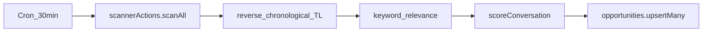
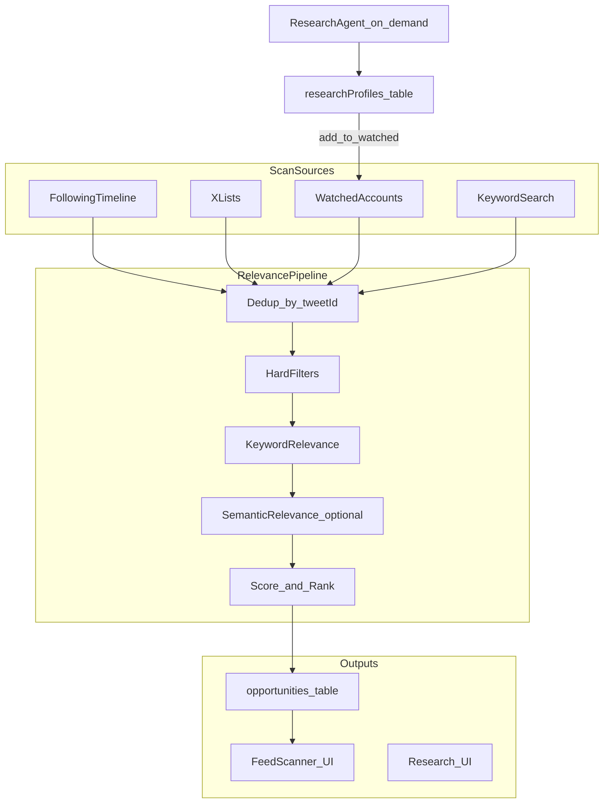
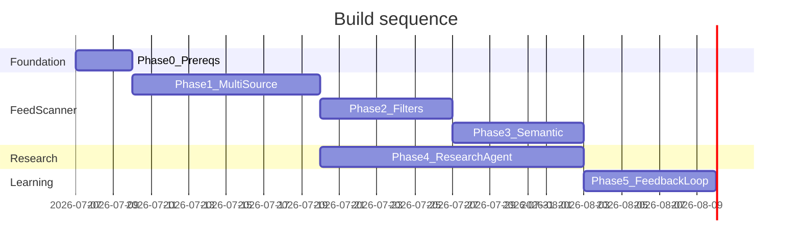

# Feed Scanner v2 + Research Agent — Build Plan

**Output doc (on approval):** `docs/BUILD_PLAN-feed-scanner-v2.md` at repo root peer of [STRATEGY.md](STRATEGY.md).

---

## Current state (baseline)

The feed scanner today is a single pipeline:




Key files:

- Ingestion: `[convex/scannerActions.ts](convex/scannerActions.ts)` — only `GET /2/users/:id/timelines/reverse_chronological`, max 50 tweets
- Scoring/filter: `[shared/scoring.ts](shared/scoring.ts)` — keyword overlap, political filter, heuristic 0–100 score
- Settings: `[convex/scanner.ts](convex/scanner.ts)` + `[convex/schema.ts](convex/schema.ts)` — `enabled`, `keywords` only
- UI: `[src/components/app/feed-scanner.tsx](src/components/app/feed-scanner.tsx)`, `[src/components/app/opportunity-card.tsx](src/components/app/opportunity-card.tsx)`

**PRD gap:** [PRD.md](PRD.md) § Feed Scanner promises lists + saved creators; landing copy in `[src/app/page.tsx](src/app/page.tsx)` already claims this — not implemented.

**OAuth gap:** `[src/lib/x.ts](src/lib/x.ts)` scopes are `tweet.read users.read tweet.write offline.access`. List import requires adding `list.read` (and re-auth for existing users).

**Existing reuse:** `fetchTopReplies` already calls `GET /2/tweets/search/recent` in `[src/lib/x.ts](src/lib/x.ts)` — pattern to extract into shared X client helpers for scanner + research agent.

---

## Target architecture




**Permanent constraints (do not regress):**

- Human click to send on every post ([AGENTS.md](AGENTS.md), [PRD.md](PRD.md))
- Demo mode must work without X/Anthropic keys (`[shared/demoData.ts](shared/demoData.ts)`)
- No fake-precision engagement scores in UI
- X API reply restriction (Feb 2026): publish failures → standalone fallback via `[shared/xErrors.ts](shared/xErrors.ts)`

---

## Phase 0 — Prerequisites (0.5 week)

Before feature work:

1. **OAuth scope expansion** — add `list.read` to `X_OAUTH_SCOPES` in `[src/lib/x.ts](src/lib/x.ts)`; document re-connect flow in Settings when scope missing
2. **Shared X timeline helpers** — extract from `scannerActions.ts` into `shared/xTimeline.ts` (or `src/lib/x.ts` + import from Convex action): normalize tweet shape, pagination, error mapping
3. **API tier audit** — document in build doc which endpoints need Basic vs Pro (timeline read, search/recent, list tweets); add graceful errors when 403 (mirror existing pattern in `fetchXTimeline`)
4. **Demo data extensions** — add demo lists, watched handles, and search results to `[shared/demoData.ts](shared/demoData.ts)` so all new UI works in demo mode

---

## Phase 1 — Multi-source ingestion (P0, ~1.5 weeks)

**Goal:** Close the SuperX/TweetHunter/Hypefury gap — intentional sources, not raw home feed alone.

### Schema (`[convex/schema.ts](convex/schema.ts)`)

Extend `scannerSettings`:

```ts
engageListIds: v.optional(v.array(v.string()))   // X list IDs
engageListNames: v.optional(v.array(v.string())) // display cache
watchedHandles: v.optional(v.array(v.string()))  // max 50 v1
searchKeywords: v.optional(v.array(v.string()))  // discovery keywords
enabledSources: v.optional(v.array(
  v.union(v.literal("following"), v.literal("lists"), v.literal("watched"), v.literal("search"))
))
dismissedAuthors: v.optional(v.array(v.object({
  handle: v.string(),
  until: v.number(), // cooldown expiry
})))
```

Extend `opportunities`:

```ts
source: v.union(v.literal("following"), v.literal("list"), v.literal("watched"), v.literal("search"))
sourceLabel: v.optional(v.string()) // e.g. "AI Builders list"
```

### Backend


| Task                      | File(s)                                                                                 |
| ------------------------- | --------------------------------------------------------------------------------------- |
| Fetch owned lists         | New `fetchOwnedLists` in shared X client; action or server route for list picker        |
| Fetch list tweets         | `GET /2/lists/:id/tweets` in `[convex/scannerActions.ts](convex/scannerActions.ts)`     |
| Fetch watched user tweets | `GET /2/users/:id/tweets?exclude=retweets,replies` per handle (batch, rate-limit)       |
| Merge + dedup             | Single `collectCandidates()` before scoring; cap ~150 raw tweets/scan                   |
| Source boost in score     | `[shared/scoring.ts](shared/scoring.ts)`: +10 for `list`/`watched`; +15 if age < 45 min |
| Settings mutations        | `[convex/scanner.ts](convex/scanner.ts)` — validate max handles/lists                   |
| List import API           | Server action in `[src/app/actions.ts](src/app/actions.ts)`                             |


### UI (`[src/components/app/feed-scanner.tsx](src/components/app/feed-scanner.tsx)`)

- **Sources panel:** toggle sources; comma keywords (filter) vs search keywords (discovery)
- **Engage lists:** "Import from X" → pick from owned lists (multi-select, max 5)
- **Watched accounts:** add/remove `@handle` chips
- **Opportunity cards:** source badge ("From AI Builders list") in `[opportunity-card.tsx](src/components/app/opportunity-card.tsx)`

### Cron tuning (`[convex/crons.ts](convex/crons.ts)`)

- Keep 30-min global cron; internally prioritize watched/list sources when token budget tight
- Optional: split to 15-min cron for watched-only (later optimization)

### Tests

- Extend `[tests/scoring.test.ts](tests/scoring.test.ts)`: source boosts, dedup logic
- New tests for list/handle normalization helpers

**Exit criteria:** User with real X connection sees opportunities from at least 2 sources; demo user sees multi-source demo opportunities; source badge visible on cards.

---

## Phase 2 — Quality filters (P1, ~1 week)

**Goal:** TweetHunter-style clean feed — less noise, no repeats.

### Hard filters (pre-score, in `collectCandidates` or new `shared/feedFilters.ts`)


| Filter                      | Implementation                                                                                                                                         |
| --------------------------- | ------------------------------------------------------------------------------------------------------------------------------------------------------ |
| Already replied             | Join `savedDrafts` + `generatedReplies` where `status=published` and `targetTweetId` matches; optionally user's recent replies via X API if affordable |
| Dismissed author cooldown   | `scannerSettings.dismissedAuthors` — 7-day default on dismiss                                                                                          |
| Retweets / reply-only posts | Exclude RT prefix and `in_reply_to` when metadata available                                                                                            |
| Political / off-niche       | Keep existing `[isPoliticalContent](shared/scoring.ts)`                                                                                                |
| Saturated threads           | Penalize (not hard-drop) if replies > 150 unless source is `watched`                                                                                   |
| Max per author              | Rank stage: max 2 tweets per author in top 12                                                                                                          |


### UI filters

- Quick toggles on feed page: "Watched only", "< 1h old", "High velocity"
- Persist dismiss → write author to cooldown on `[dismiss](convex/opportunities.ts)`

### Search source

- `GET /2/tweets/search/recent?query=` per `searchKeywords` entry (1 request/keyword/scan, respect rate limits)
- Merge into candidate pool with `source: "search"`

**Exit criteria:** Re-opening feed after replying to a tweet does not resurface it; dismissed authors stay hidden for cooldown period.

---

## Phase 3 — Semantic relevance (P2, ~1 week)

**Goal:** Catch paraphrased niche fit that keyword matching misses (2026 X uses semantic clusters, not hashtags).

### Approach

- **Cheap classifier pass** in Convex action (`"use node"`): Anthropic Haiku or structured call with niche context built from:
  - User keywords
  - Default voice profile topics
  - Last 10 `tweetAnalyses.topic` values for user
- Output: `semanticRelevance` 0–1 + one-line reason (internal, folded into existing `reason` string)
- **Formula update** in `[shared/scoring.ts](shared/scoring.ts)`:
  ```ts
  topicRelevance = max(keywordScore, semanticScore * 0.9)
  ```
- **Cache:** Store semantic score on `opportunities` row; skip re-classify if tweet unchanged and < 24h old
- **Demo:** Deterministic semantic scores from keyword hash in demo branch

**Cost control:** Classify only tweets passing keyword pre-filter OR from watched/list sources (not all 150 raw candidates).

**Exit criteria:** Test case: tweet about "AI agents for support" matches keyword "ai" without exact keyword; political tweet with generic keyword still filtered.

---

## Phase 4 — Research Agent v1 (P3, ~2 weeks)

**Goal:** On-demand profile discovery — automate "who should I learn from and engage with" (SuperX viral library + TweetHunter Lead Finder, personalized).

### Schema (new tables in `[convex/schema.ts](convex/schema.ts)`)

```ts
researchProfiles: defineTable({
  userId, xUserId, handle, displayName, bio,
  followers, avgLikes, postFrequency,
  topicTags: v.array(v.string()),
  score: v.number(),
  reason: v.string(),
  exampleTweets: v.array(v.object({ tweetId, text, likes })),
  status: v.union(v.literal("suggested"), v.literal("watching"), v.literal("passed")),
  discoveredAt: v.number(),
}).index("by_user_status", ["userId", "status"])

researchRuns: defineTable({
  userId, query: v.string(), seedHandles: v.array(v.string()),
  resultCount: v.number(), createdAt: v.number(),
}).index("by_user", ["userId"])
```

### Agent flow (`[convex/researchActions.ts](convex/researchActions.ts)` — new)

1. **Input:** natural language query + optional seed `@handle`
2. **Seed expansion:** user's watched handles, recent analyses topics, voice profile
3. **X search:** `search/recent` for query + `from:handle` top tweets for seeds
4. **Profile scoring:** followers band, avg engagement, topic overlap with user niche, reply-friendly signals (questions, < 200 replies)
5. **LLM synthesis:** structured output — top 10 profiles, 3 example tweets each, "why follow" (plain language, no fake scores)
6. **Persist** to `researchProfiles`; user actions: **Watch** (adds to `watchedHandles`), **Pass**, **Analyze tweet** (deep link to analyze flow)

### UI

- New route: `[src/app/(app)/research/page.tsx](src/app/(app)`/research/page.tsx)
- Nav link in `[src/components/app/sidebar/nav-links.ts](src/components/app/sidebar/nav-links.ts)`
- Components: `ResearchQueryForm`, `ProfileSuggestionCard`
- **Watch** button → mutation updates `scannerSettings.watchedHandles` + profile status

### Demo mode

- `[shared/demoData.ts](shared/demoData.ts)`: 5 fixed suggested profiles + example tweets

### Guardrails

- User-triggered only (no cron) — controls API cost
- Suggest only; no auto-follow, auto-DM, auto-reply
- Rate limit: max 3 research runs/user/day (store in `usage` or `researchRuns`)

**Exit criteria:** User runs query → sees ranked profiles → clicks Watch → next scanner cycle surfaces tweets from that account.

---

## Phase 5 — Outcome feedback loop (P4, ~1 week)

**Goal:** Per [STRATEGY.md](STRATEGY.md) track 4 — ranking improves from real send/response data.

### Instrumentation

Extend `opportunities`:

```ts
outcome: v.optional(v.union(
  v.literal("ignored"), v.literal("analyzed"), v.literal("sent"), v.literal("responded")
))
analyzedAt, sentAt, respondedAt: v.optional(v.number())
```


| Event       | Trigger                                                                       |
| ----------- | ----------------------------------------------------------------------------- |
| `analyzed`  | User opens Analyze from opportunity card → patch on analysis create           |
| `sent`      | Draft published with `targetTweetId` matching opportunity                     |
| `responded` | Weekly cron polls reply thread for author reply (optional v1.1 if API costly) |


### Ranking tuning (internal only)

- Weekly `internalMutation`: compute conversion rates by `source`, author follower band, score decile
- Store per-user weights in `scannerSettings.rankingWeights` (optional JSON)
- Apply as multiplier in `scoreConversation` — **never shown as ML % to user**

### Dashboard metric

- Surface **opportunity → analyze conversion** on dashboard (`[src/components/app/dashboard.tsx](src/components/app/dashboard.tsx)`) — aligns with STRATEGY key metrics

**Exit criteria:** Funnel events stored; list-sourced opportunities that convert rank higher after 2 weeks of data (manual verification in dev).

---

## File change summary


| Area    | New                                                        | Modified                                                                 |
| ------- | ---------------------------------------------------------- | ------------------------------------------------------------------------ |
| Schema  | `researchProfiles`, `researchRuns`                         | `scannerSettings`, `opportunities`                                       |
| Convex  | `researchActions.ts`, `research.ts`                        | `scannerActions.ts`, `scanner.ts`, `opportunities.ts`, `crons.ts`        |
| Shared  | `xTimeline.ts` or extend `x.ts` patterns, `feedFilters.ts` | `scoring.ts`, `demoData.ts`                                              |
| Next.js | `research/page.tsx`, research components                   | `feed-scanner.tsx`, `opportunity-card.tsx`, `actions.ts`, `nav-links.ts` |
| Auth    | —                                                          | `x.ts` scopes                                                            |
| Tests   | `feedFilters.test.ts`, `research.test.ts`                  | `scoring.test.ts`                                                        |
| Docs    | `docs/BUILD_PLAN-feed-scanner-v2.md`                       | `README.md` feed scanner section                                         |


---

## Sequencing and dependencies




**Parallel track:** Phase 4 (Research Agent) can start after Phase 1 completes (needs `watchedHandles` wiring). Phase 3 and 4 can overlap.

**Recommended ship order:** P0 → P1 → P2 → ship beta → P4 → P3 → P5.

---

## Risks and mitigations


| Risk                                      | Mitigation                                                                   |
| ----------------------------------------- | ---------------------------------------------------------------------------- |
| X API 403 on timeline/search (Basic tier) | Graceful per-source errors; demo mode; clear Settings messaging              |
| Search rate limits                        | Cap keywords/scan; backoff; prioritize lists/watched                         |
| Semantic pass LLM cost                    | Classify filtered subset only; cache 24h                                     |
| Re-auth friction for `list.read`          | Detect missing scope; prompt re-connect once                                 |
| Research agent low-quality suggestions    | Require seed handles + niche keywords; show example tweets for user judgment |


---

## Verification checklist (each phase)

Run before merge: `npm run typecheck && npm run lint && npm test && npm run build`

Manual QA paths:

- Demo mode: full flow without keys
- Live X: list import → scan → opportunity with source badge → analyze → send
- Research: query → watch → scanner picks up watched account tweets

---

## Out of scope (explicit)

- Auto-post, auto-DM, auto-retweet (competitor features we intentionally skip)
- Multi-account / agency (PRD v1 constraint)
- Global viral tweet library (SuperX 10M+) — personalized discovery only
- Chrome extension (SuperX) — web app first

