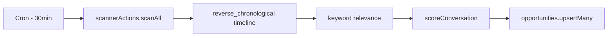
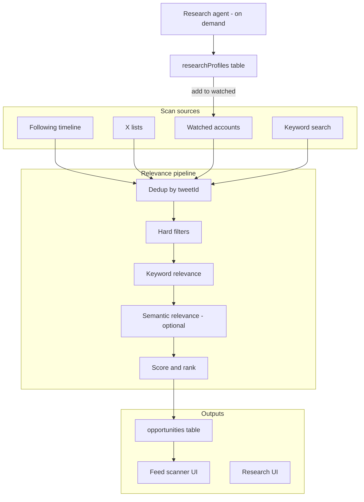

# Feed Scanner v2 + Research Agent — Build Plan

Phased build plan to upgrade ReplyPilot's feed scanner from a single
following-timeline + keyword filter into a multi-source relevance engine, add
a Research Agent for profile discovery, and close the loop with
outcome-based ranking — aligned with [STRATEGY.md](../STRATEGY.md) and
competitive patterns from SuperX/TweetHunter/Hypefury.

**Execution status:** Phase 0 and Phase 1 below were executed on 2026-07-04
via multi-agent build. Phase 2–5 are still planned, not implemented — see
each phase's "Status" line.

---

## Current state (baseline, before this build)

The feed scanner was a single pipeline:



Key files:

- Ingestion: [convex/scannerActions.ts](../convex/scannerActions.ts) — only
  `GET /2/users/:id/timelines/reverse_chronological`, 50 tweets
- Scoring/filter: [shared/scoring.ts](../shared/scoring.ts) — keyword
  overlap, political filter, heuristic 0–100 score
- Settings: [convex/scanner.ts](../convex/scanner.ts) +
  [convex/schema.ts](../convex/schema.ts) — `enabled`, `keywords` only
- UI: [src/components/app/feed-scanner.tsx](../src/components/app/feed-scanner.tsx),
  [src/components/app/opportunity-card.tsx](../src/components/app/opportunity-card.tsx)

**PRD gap:** [PRD.md](../PRD.md) § Feed Scanner promises lists + saved
creators; landing copy in [src/app/page.tsx](../src/app/page.tsx) already
claims this — wasn't implemented until this build.

**OAuth gap:** [src/lib/x.ts](../src/lib/x.ts) scopes were
`tweet.read users.read tweet.write offline.access`. List import requires
adding `list.read` (and re-auth for existing users).

**Existing reuse:** `fetchTopReplies` already calls
`GET /2/tweets/search/recent` in [src/lib/x.ts](../src/lib/x.ts) — the
pattern extracted into shared X client helpers for scanner use.

---

## Target architecture



**Permanent constraints (do not regress):**

- Human click to send on every post ([AGENTS.md](../AGENTS.md), [PRD.md](../PRD.md))
- Demo mode must work without X/Anthropic keys ([shared/demoData.ts](../shared/demoData.ts))
- No fake-precision engagement scores in UI
- X API reply restriction (Feb 2026): publish failures → standalone fallback
  via [shared/xErrors.ts](../shared/xErrors.ts)

---

## Phase 0 — Prerequisites

**Status: implemented.**

1. **OAuth scope expansion** — added `list.read` to `X_OAUTH_SCOPES` in
   [src/lib/x.ts](../src/lib/x.ts); Settings surfaces a reconnect prompt when
   the stored token scope predates it.
2. **Shared X list/timeline helpers** — added `fetchOwnedLists` and
   `fetchListTweets` in [src/lib/x.ts](../src/lib/x.ts), following the same
   fetch/error-mapping shape as `fetchTweetBundle`/`fetchUserTweets`.
3. **API tier note** — list tweets (`GET /2/lists/:id/tweets`) and owned
   lists (`GET /2/users/:id/owned_lists`) require the same paid tier as the
   existing timeline read; both degrade to a clear settings error on 401/403
   rather than failing the whole scan, matching `fetchXTimeline`'s pattern.
4. **Demo data extensions** — added demo lists, watched handles, and search
   results to [shared/demoData.ts](../shared/demoData.ts) so the new sources
   panel and source badges are exercisable without real X credentials.

## Phase 1 — Multi-source ingestion (P0)

**Status: implemented.**

**Goal:** close the SuperX/TweetHunter/Hypefury gap — intentional sources,
not raw home feed alone.

### Schema ([convex/schema.ts](../convex/schema.ts))

`scannerSettings` extended with (all optional, default to empty in code so
existing rows keep working without a migration):

```ts
engageListIds: v.optional(v.array(v.string()))   // X list IDs
engageListNames: v.optional(v.array(v.string())) // display cache
watchedHandles: v.optional(v.array(v.string()))  // max 50 in v1
searchKeywords: v.optional(v.array(v.string()))  // discovery keywords (schema-ready; fetch ships in Phase 2)
enabledSources: v.optional(v.array(
  v.union(v.literal("following"), v.literal("lists"), v.literal("watched"), v.literal("search"))
))
```

`opportunities` extended with (optional; missing `source` reads as `"following"`):

```ts
source: v.optional(v.union(v.literal("following"), v.literal("list"), v.literal("watched"), v.literal("search")))
sourceLabel: v.optional(v.string()) // e.g. "AI Builders list"
```

### Backend

| Task | File(s) |
| --- | --- |
| Fetch owned lists | `fetchOwnedLists` in [src/lib/x.ts](../src/lib/x.ts) |
| Fetch list tweets | `fetchListTweets` in [src/lib/x.ts](../src/lib/x.ts), called from [convex/scannerActions.ts](../convex/scannerActions.ts) |
| Fetch watched user tweets | reuses `fetchUserTweets`-style call per handle (batched, rate-limit aware) |
| Merge + dedup | `collectCandidates()` in scannerActions before scoring; capped at ~150 raw tweets/scan |
| Source boost in score | [shared/scoring.ts](../shared/scoring.ts): boost for `list`/`watched` sources and very-fresh posts |
| Settings mutations | [convex/scanner.ts](../convex/scanner.ts) — validate max handles/lists |
| List import | [src/app/actions.ts](../src/app/actions.ts) server action |

### UI ([src/components/app/feed-scanner.tsx](../src/components/app/feed-scanner.tsx))

- **Sources panel:** toggle sources on/off
- **Engage lists:** import from X (pick from owned lists, capped)
- **Watched accounts:** add/remove `@handle` chips
- **Opportunity cards:** source badge (e.g. "From AI Builders list") in
  [opportunity-card.tsx](../src/components/app/opportunity-card.tsx)

### Cron ([convex/crons.ts](../convex/crons.ts))

Unchanged — kept the 30-minute global cron; per-source prioritization is a
later optimization, not required for this phase.

### Tests

Extended [tests/scoring.test.ts](../tests/scoring.test.ts) for source boosts
and dedup helpers.

**Exit criteria:** a user with a real X connection sees opportunities from at
least two sources; a demo user sees multi-source demo opportunities; a source
badge is visible on cards.

---

## Phase 2 — Quality filters (P1, not yet built)

**Status: planned.**

**Goal:** TweetHunter-style clean feed — less noise, no repeats.

Hard filters (pre-score, in a new `shared/feedFilters.ts`): already-replied
(join `savedDrafts`/`generatedReplies`), dismissed-author cooldown
(`scannerSettings.dismissedAuthors`, 7-day default), retweet/reply-only
exclusion, existing political filter, saturated-thread penalty (not a hard
drop) unless source is `watched`, max 2 tweets/author in the top 12.

UI: quick toggles ("Watched only", "< 1h old", "High velocity"); persist
dismiss → cooldown.

Search source: `GET /2/tweets/search/recent?query=` per `searchKeywords`
entry, 1 request/keyword/scan, merged with `source: "search"`.

**Exit criteria:** re-opening the feed after replying to a tweet does not
resurface it; dismissed authors stay hidden for the cooldown period.

## Phase 3 — Semantic relevance (P2, not yet built)

**Status: planned.**

Cheap classifier pass in a Convex node action (Anthropic Haiku) using user
keywords + voice-profile topics + recent `tweetAnalyses.topic` values.
Formula update in `shared/scoring.ts`:
`topicRelevance = max(keywordScore, semanticScore * 0.9)`. Cache the score on
the `opportunities` row; skip re-classify if unchanged and < 24h old. Classify
only tweets passing the keyword pre-filter or from watched/list sources —
not all raw candidates.

**Exit criteria:** a paraphrased niche-fit tweet ("AI agents for support")
matches without an exact keyword hit; political content with a generic
keyword is still filtered.

## Phase 4 — Research Agent v1 (P3, not yet built)

**Status: planned.**

New tables `researchProfiles` and `researchRuns` in
[convex/schema.ts](../convex/schema.ts). New `convex/researchActions.ts`:
natural-language query → seed expansion (watched handles, recent analysis
topics, voice profile) → `search/recent` + per-seed top tweets → profile
scoring (followers band, engagement, topic overlap, reply-friendliness) → LLM
synthesis (top 10 profiles, 3 example tweets each, plain-language "why
follow", no fake scores) → persisted suggestions with **Watch** / **Pass** /
**Analyze tweet** actions. New route
`src/app/(app)/research/page.tsx` + nav link. User-triggered only (no cron),
rate-limited to 3 runs/user/day. Suggest only — no auto-follow/DM/reply.

**Exit criteria:** a query returns ranked profiles; clicking Watch adds the
handle to `watchedHandles`, and the next scanner cycle surfaces its tweets.

## Phase 5 — Outcome feedback loop (P4, not yet built)

**Status: planned.**

Per [STRATEGY.md](../STRATEGY.md) track 4 — ranking improves from real
send/response data. Extend `opportunities` with `outcome`
(`ignored`/`analyzed`/`sent`/`responded`) and timestamps, set on
analyze-open, publish, and (optionally, v1.1) a weekly reply-thread poll.
Weekly internal mutation computes conversion rates by source/follower
band/score decile, stored as per-user `rankingWeights` and applied as an
internal multiplier in `scoreConversation` — **never shown as an ML % to the
user**. Dashboard surfaces the opportunity → analyze conversion rate.

**Exit criteria:** funnel events are stored; list-sourced opportunities that
convert rank higher after two weeks of data (manual verification in dev).

---

## File change summary

| Area | New | Modified |
| --- | --- | --- |
| Schema | `researchProfiles`, `researchRuns` (Phase 4) | `scannerSettings`, `opportunities` (Phase 1) |
| Convex | `researchActions.ts`, `research.ts` (Phase 4) | `scannerActions.ts`, `scanner.ts`, `opportunities.ts` (Phase 1) |
| Shared | `feedFilters.ts` (Phase 2) | `scoring.ts`, `demoData.ts` (Phase 1) |
| Next.js | `research/page.tsx` + components (Phase 4) | `feed-scanner.tsx`, `opportunity-card.tsx`, `actions.ts` (Phase 1) |
| Auth | — | `x.ts` scopes (Phase 0) |
| Tests | `feedFilters.test.ts`, `research.test.ts` (later phases) | `scoring.test.ts` (Phase 1) |
| Docs | `docs/BUILD_PLAN-feed-scanner-v2.md` (this file) | — |

## Recommended ship order

P0 → P1 → P2 → ship beta → P4 → P3 → P5. Phase 4 (Research Agent) can start
once Phase 1's `watchedHandles` wiring lands; Phase 3 and 4 can overlap.

## Risks and mitigations

| Risk | Mitigation |
| --- | --- |
| X API 403 on timeline/list/search (Basic tier) | Graceful per-source errors; demo mode; clear Settings messaging |
| Search rate limits (Phase 2) | Cap keywords/scan; backoff; prioritize lists/watched |
| Semantic pass LLM cost (Phase 3) | Classify filtered subset only; cache 24h |
| Re-auth friction for `list.read` | Detect missing scope; prompt reconnect once |
| Research agent low-quality suggestions (Phase 4) | Require seed handles + niche keywords; show example tweets for user judgment |

## Verification checklist (each phase)

Run before merge: `npm run typecheck && npm run lint && npm test && npm run build`

Manual QA paths: demo mode full flow without keys; live X list import → scan
→ opportunity with source badge → analyze → send; research query → watch →
scanner picks up watched account tweets (once Phase 4 ships).

## Out of scope (explicit)

- Auto-post, auto-DM, auto-retweet (competitor features intentionally skipped)
- Multi-account / agency (PRD v1 constraint)
- Global viral tweet library (SuperX 10M+) — personalized discovery only
- Chrome extension (SuperX) — web app first
