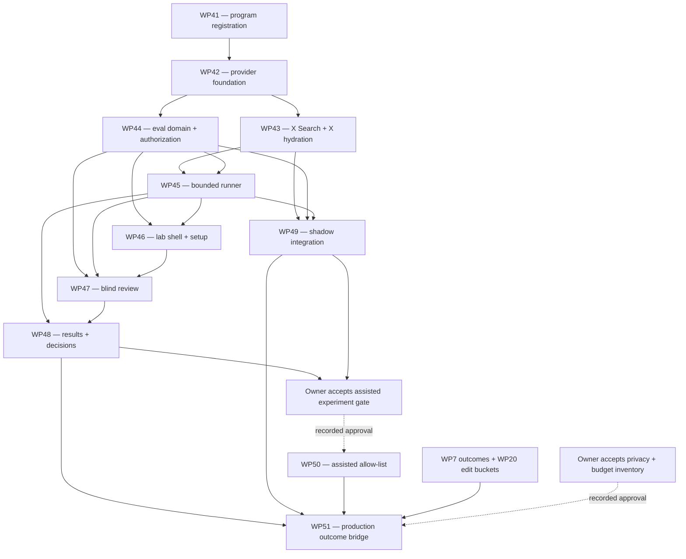

# WP41 — Grok + Model Evaluation Lab implementation program

**Status:** registered; implementation not started  
**Strategy package:** WP41  
**Implementation packages:** WP42–WP51  
**Source decisions:** `PRD.md`, `docs/PRODUCT_STRATEGY.md` §4/§14,
`tasks/prd-grok-assisted-x-discovery.md`,
`tasks/prd-model-evaluation-lab.md`, and `docs/wp/RULINGS.md`

## 1. Program contract

This brief turns the two approved PRDs into merge-ordered, independently
reviewable implementation packages. WP41 changes documentation only. It does
not configure a provider, create an experiment, alter discovery, or enable a
rollout mode.

The following decisions are fixed for this program:

- The initial xAI model is pinned `grok-4.3` with low discovery reasoning;
  entitlement is verified against the authenticated `/v1/models` response.
- Grok's first production role is X discovery/research. Claude remains the
  default production generation and voice provider.
- X API hydration remains authoritative for post identity, timestamps,
  metrics, personalized sources, and publishing permissions.
- Rollout states are `off`, `shadow`, and `assisted`. Production defaults to
  `off` or `shadow`; `assisted` is allow-listed, owner-gated, independently
  reversible, and never enabled globally by an implementation PR.
- The lab is authenticated and server-authorized for product operators only.
  Browser-hidden navigation is not authorization.
- Existing `modelEvals` records remain readable. The new lab is additive and
  does not force historical rows into the new experiment schema.
- Checked-in deterministic generation evals remain key-free and keep gating CI.
  Zero-key fixture/demo experiments and unrelated demo flows continue to work.
- No customer-facing model picker, predicted engagement score, automatic
  production-routing mutation, auto-publish, auto-reply, scheduled agent send,
  or extension injection is introduced.

## 2. Dependency graph

An arrow means the predecessor must be merged and its package gate green before
the successor begins. A dotted owner gate is a human decision, not a code
dependency.

WP45 may scaffold generation-only runner work once WP42 and WP44 are green,
but it cannot request review as complete until WP43's discovery contract is
integrated and discovery/pipeline fixture runs pass. WP49 may run in parallel
with lab UI packages after WP45; it never waits on a user-facing results page.
WP50 and WP51 remain sequential because both cross into production-derived
behavior and evidence.

## 3. Waves and gates

Every implementation PR follows `docs/AGENT_PLAYBOOK.md`: one WP per branch/PR,
atomic stories, checked progress, no self-merge, full repo checks, and the
required security/code/browser reviews for the surfaces touched. A wave closes
only after its post-merge gate passes on current `main`.

| Wave | Packages | Start condition | Required post-merge gate |
|---|---|---|---|
| 0 — registration | WP41 | Base strategy through WP40 | WP41–WP51 row identifiers unique; §14 dependencies match this brief; collision owners assigned; docs diff reviewed; `git diff --check` green |
| 1 — provider boundary | WP42 | WP41 merged | Full repo suite with zero external keys; provider contracts, redaction, normalized usage/error/cost, deterministic fallback, and failed entitlement fixtures pass; no scanner/UI diff |
| 2 — search + domain | WP43 and WP44 in parallel | WP42 gate green | Full suite plus provider/security tests; cited candidates fail closed without X hydration; all public eval surfaces have session + operator authorization; account inventory covers new tables; historical `modelEvals` read fixture passes |
| 3 — execution | WP45 | WP43 and WP44 merged | Generation, discovery, and pipeline fixture runs prove frozen input/seed/version, idempotent resume, cancellation, partial-provider failure, and spend/tool caps with zero keys; counts reconcile and production routing is unchanged |
| 4 — setup + shadow | WP46 and WP49 in parallel | WP45 gate green | Full suite; authorized/unauthorized lab create/start/status/cancel browser checks pass; deterministic shadow sampling produces internal records while feed order, surfaced rows, and notification candidates are byte-for-byte unchanged in focused tests |
| 5 — blind review | WP47 | WP46 merged; WP45 contracts stable | Blind identity/order tests, independent-review audit tests, keyboard flow, and desktop/mobile authorized/unauthorized browser checks pass; identity/cost/judge data is absent before submission |
| 6 — evidence | WP48 | WP47 merged | Aggregates reconcile to fixtures including failures/exclusions; minimum-sample and confidence-interval tests pass; export is redacted/authorized; recorded decisions do not mutate rollout configuration |
| 7 — assisted capability | WP50 | WP48 evidence + WP49 shadow data satisfy the owner gate | Disabled-by-default allow-list verified; hydration/filter/ranking/diversity/rollback tests and desktop/mobile feed checks pass; production config remains `off` or `shadow`; no global enablement |
| 8 — outcomes | WP51 | WP50 merged; privacy/budget inventory approved; WP7/WP20 data available | Consented linkage and account export/deletion reconcile; lab, deterministic, judge, and production metrics remain separate; automation caps fail closed; full security/demo/mobile gate passes; no publish or implicit routing path exists |

The full repo suite is `npm run typecheck && npm run lint && npm test && npm run
build`. Real-key smoke tests are operator gates and never replace zero-key CI.

## 4. Collision matrix and file ownership

Workers own only their §14 key files plus story artifacts. New files should use
the named ownership seams below so later packages consume APIs instead of
reopening a predecessor's implementation. If satisfying a DoD requires a file
outside these boundaries, stop and request a ruling; do not broaden scope in the
worker PR.

| Packages | Collision surface | Resolution / owner order |
|---|---|---|
| WP42 → WP43 | `src/lib/providers/**`, provider contracts, `src/lib/ai.ts` | WP42 owns shared contracts, catalog/config, and existing AI refactor. WP43 rebases, then adds only xAI search/hydration adapters and discovery validation; it does not redesign the contracts |
| WP42 → WP44/WP45 | candidate catalog and normalized provider/run types | WP42 owns provider-neutral primitive types. WP44 owns persisted eval-domain types/catalog IDs. WP45 consumes both; browser input never supplies raw provider model IDs |
| WP43 → WP49 | xAI adapter, citations, hydration | WP43 owns provider execution and pure validation. WP49 consumes the normalized result from scanner orchestration and must not fork or duplicate the provider client |
| WP44 → WP45 | `convex/eval*.ts`, run/output records | WP44 owns schema, authorization, immutable records, and catalog validation. WP45 adds runner-specific action/job modules and calls domain mutations; rebase after WP44 rather than editing the same exports in parallel |
| WP44 → WP49 → WP51 | `convex/schema.ts`, `shared/accountData.ts`, `convex/account.ts` | WP44 lands canonical eval tables and cascade support first. WP49 adds only shadow provenance fields/tables after rebasing. WP51, last, adds consented outcome linkage and updates the same account-data inventory |
| WP45 ↔ WP49 | spend controls and eval linkage | WP45 owns experiment budget/concurrency/tool enforcement in runner modules. WP49 owns scanner/shadow admission and existing global AI/X spend checks. Shared spend helper changes require orchestrator sequencing, not parallel edits |
| WP46 → WP47 → WP48 | `/evals` routes and `src/components/app/evals/**` | WP46 owns `/evals`, `/evals/new`, app navigation, and setup/table components. WP47 owns only `[experimentId]/review` and `evals/review/**`. WP48 owns `[experimentId]/page.tsx` and `evals/results/**` |
| WP47 → WP48 | judgments, reveal policy, aggregations | WP47 owns assignment/submission functions and reveal eligibility. WP48 consumes judgments in separate aggregation/export/decision modules; it does not loosen blind-review rules |
| WP49 → WP50 | `convex/scannerActions.ts`, opportunity insertion, rollout config | Strictly sequential. WP49 owns shadow sampling/provenance and guarantees no visible writes. WP50 rebases and adds the disabled allow-listed merge path through existing `convex/opportunities.ts` filters |
| WP50 → WP51 | production-derived data | WP50 owns discovery admission only. WP51 owns consented outcome linkage and optional bounded shadow automation; it cannot turn an experiment decision into live routing |

`src/app/actions.ts`, `convex/crons.ts`, the typed analytics catalogs, and shared
spend helpers are high-collision files even when a row describes them by area.
Only the package with an acceptance criterion requiring a change may edit the
smallest named action/event/cron block, after rebasing on earlier owners.

## 5. Routing ledger

The tiers below are recommendations based on correctness risk, not proof of
actual execution. This runtime does **not** support or enforce per-subagent
model or reasoning-effort routing. Workers inherit the current runtime. The
orchestrator must record the actual inherited runtime at assignment and must
not claim that a recommendation was applied. Escalation means reassigning in a
runtime that genuinely supports the requested tier, if one is available.

| WP | Recommended target | Risk rationale | Runtime record |
|---|---|---|---|
| WP41 | Economy / low effort | Fixed docs-only decomposition; adversarial consistency checks catch most errors | Requested, but not enforceable; inherited current runtime |
| WP42 | High | Cross-provider architecture, secrets/redaction, entitlement, cost normalization, and demo fallback affect every later package | Inherited current runtime unless orchestrator records otherwise |
| WP43 | High | Untrusted X content, external tool budgets, citation integrity, hydration, and publish isolation are security-sensitive | Inherited current runtime unless orchestrator records otherwise |
| WP44 | High | Authorization, sensitive snapshots, schema/index design, deletion/export, and historical compatibility are high-impact | Inherited current runtime unless orchestrator records otherwise |
| WP45 | High | Resumability, idempotency, cancellation, concurrency, and spend enforcement require architecture-heavy correctness | Inherited current runtime unless orchestrator records otherwise |
| WP46 | Mid | Well-specified UI built on stable actions; route authorization and cost confirmation still require careful review | Inherited current runtime unless orchestrator records otherwise |
| WP47 | Mid/high | Focused UI/domain slice, but blinding and authorization leakage would invalidate evidence | Inherited current runtime unless orchestrator records otherwise |
| WP48 | High | Statistics, reveal policy, exports, and promotion evidence can mislead or disclose data if wrong | Inherited current runtime unless orchestrator records otherwise |
| WP49 | High | Production scanner integration, spend controls, telemetry, and the no-visible-effect invariant are high-risk | Inherited current runtime unless orchestrator records otherwise |
| WP50 | High | Owner-gated production admission and rollback can alter user-visible discovery | Inherited current runtime unless orchestrator records otherwise |
| WP51 | High | Consent, user-derived outcomes, account deletion/export, automation, and production coupling are privacy-sensitive | Inherited current runtime unless orchestrator records otherwise |

## 6. Rollout and owner gates

### Gate A — real xAI operator smoke test

After WP43 is green in zero-key CI, an operator may supply the secret outside
git and confirm that the authenticated xAI team lists the pinned model in
`/v1/models`. The fixed non-user search case must record returned model ID,
region/cluster metadata when supplied, usage, successful tool calls, latency,
citations, hydration, and normalized error/cost. Missing entitlement keeps the
provider disabled and is not a reason to weaken fallback behavior.

Before paid experiments or shadow runs, the owner must approve concrete maximum
spend per experiment/day, tool-call limits, concurrency, shadow sample ceiling,
and circuit-breaker thresholds. Secrets and values stay out of this repository.

### Gate B — shadow to assisted

WP50 may begin only after the owner records approval against one exact
experiment/run and verifies all of the following:

- at least 100 reviewed discovery cases across representative niches;
- citation integrity of at least 99% and X hydration success of at least 95%;
- statistically credible precision@10 improvement or incremental useful yield
  versus the current scanner baseline;
- incremental median/p95 latency and cost inside the predeclared budget; and
- no open privacy, safety, authorization, publishing, demo-mode, or feed-quality
  regression.

These are internal launch gates, never customer-facing engagement predictions.
Approval authorizes only a disabled-by-default, allow-listed implementation. A
separate owner action is required for each allow-list or production-config
change; the implementation PR cannot globally select `assisted`.

### Gate C — production outcome linkage

Before WP51 starts, the owner must resolve and record:

- which beta-user snapshots/outcomes may be included and the consent language;
- the required reviewer count after the initial operator-only phase;
- experiment/day and automated-shadow maximum spend;
- whether raw case text export is disabled outside local development; and
- the retention/redaction policy for normalized snapshots and citations.

Until those decisions exist, WP51 is blocked rather than permitted to invent
policy. The completed bridge keeps human preference, deterministic pass rate,
LLM-judge diagnostics, and real no/minor-edit/sent/responded outcomes as
separate metrics.

## 7. Package handoff checklist

Each worker assignment must copy its complete §14 row and add:

1. exact owned files and explicit exclusions from the collision matrix;
2. dependency commit(s) or merged-`main` SHA;
3. atomic story/progress paths for its WP;
4. zero-key, auth, security, browser, and real-key checks applicable to it;
5. the inherited runtime record from the routing ledger;
6. owner gates that are inputs versus gates the package merely prepares; and
7. a stop condition for UNKNOWNs, file-boundary expansion, or evidence that
   contradicts a fixed product decision.

No worker merges its own PR. The orchestrator reviews DoD evidence and collision
scope, then a fresh post-merge gate verifies the wave on current `main`.

